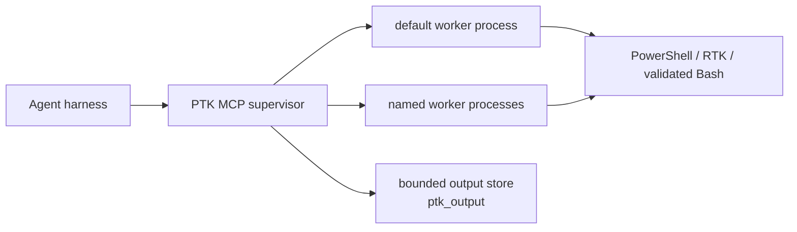

# PowerShell Token Killer (`ptk`)

[](https://github.com/AlsoBeltrix/PowerShell-Token-Killer/actions/workflows/ci.yml)

PTK is a token-efficient PowerShell execution service for AI agent harnesses.
Each MCP connection owns one supervisor process. That supervisor can manage up
to eight explicitly named sessions, including the lazy `default` session. Each
session runs in its own contained worker process with one warm PowerShell
runspace, so modules, variables, functions, working directory, environment
changes, and authenticated connections persist only inside that session.

The agent submits the original command once. PTK owns routing, output shaping
and recovery, worker lifecycle, and truthful failure reporting. It never
replays a command whose execution may have started.

> [!IMPORTANT]
> The current development branch implements the supervisor, named worker
> sessions, automatic worker replacement, five-tool MCP surface, output
> recovery, and production containment described here. PTK has not had a public
> release. See [`.agents/state.md`](.agents/state.md) for current validation and
> remaining platform gates.

## Why PTK

- **Warm, explicit state.** Foreground calls run in a selected PowerShell 7
  session. Heavy modules and connections load once per session, not once per
  command.
- **Shape-aware output.** PowerShell objects become compact typed summaries,
  eligible native commands use RTK's filters, log-shaped text is deduplicated,
  and ordinary text is cleaned and bounded.
- **Single-execution semantics.** Routing may fall back before user work
  starts. Once work starts, PTK never retries it and never asks the model to
  reconstruct the command.
- **Recoverable context.** When PTK captures a same-invocation artifact,
  `ptk_output` can retrieve an elided middle without rerunning the operation.
- **Truthful outcomes.** A request is completed, proved not started, refused,
  canceled, timed out, or reported outcome-unknown. PTK does not turn a lost
  transport into a false success.
- **Contained sessions.** Each warm session is a separate worker process.
  Reset, timeout, or loss of one session does not silently replace or corrupt
  another.

PTK is not a sandbox or authorization boundary. Commands inherit the identity,
privileges, network access, and upstream RBAC of the harness that launched PTK.

## Architecture



One harness connection owns one public supervisor. Each session owns one serial
PowerShell runspace inside its own worker process; different sessions can
progress independently. The supervisor owns the MCP pipe, session registry,
output artifacts, admission, and replacement decisions.

On Unix, a native broker creates and contains each worker process group. On
Windows, workers start inside Job Objects before user code can run. A worker is
replaced only after its old containment domain is proved empty. If an escaped
descendant makes that proof impossible, the session faults
`descendants_unknown` and refuses reuse.

While the MCP connection remains open, inactivity does not recycle warm
workers. A timed-out or lost worker is replaced from a fresh baseline; its
uncertain command is never replayed. Supervisor failure ends the MCP connection
and requires the harness to start a new one.

Sessions are deliberately harness-scoped. There is no daemon, reattachment,
cross-harness session, shared runspace, or durable session key in this design.

## Sessions

The reserved `default` session preserves unqualified tool calls and starts
lazily:

```text
ptk_invoke(script="Import-Module ActiveDirectory")
ptk_invoke(script="Get-ADUser alice")
```

Named sessions make independent warm contexts explicit:

```text
ptk_session(action="open", name="ad")
ptk_invoke(session="ad", script="Import-Module ActiveDirectory")

ptk_session(action="open", name="exo")
ptk_invoke(session="exo", script="Connect-ExchangeOnline ...")

ptk_state(session="ad")
ptk_reset(session="exo")
```

Session rules:

- Names are connection-local semantic aliases such as `ad`, `exo`, or `build`.
  Every non-default operation names its session; there is no mutable `select`.
- Unknown or closed named sessions never fall back to `default` and never
  auto-create after a typo.
- `ptk_reset` replaces the entire selected worker. It does not affect another
  session and refuses while the selected session is busy or old containment is
  unconfirmed.
- After an execution timeout returns its terminal and the old worker tree is
  confirmed dead, an otherwise eligible session automatically starts its next
  worker from the factory baseline. The timed-out call is never replayed.
- `ptk_session` supports `list`, `open`, and `close`. The lazy `default`
  session cannot be closed. Closed named sessions require an explicit `open`.
- At most eight sessions, including `default`, may be open on one connection.

### Long-running work

Raise `timeoutSeconds` when work needs the selected warm session. The budget
includes same-session queue wait and execution. PTK has no public background-job
surface: long stateless work should run through the harness's ordinary process
facilities, or run in a dedicated PTK session with a sufficient foreground
timeout.

## MCP Tools

The public surface is exactly five tools:

| Tool | Purpose |
| --- | --- |
| `ptk_invoke` | Execute the original script once in the selected warm session. |
| `ptk_output` | Read, search, or inspect an immutable same-invocation artifact. It accepts no script and never executes work. |
| `ptk_state` | Report supervisor and selected-session health, worker PID, engine, cwd, modules, and drift without queueing behind that session. |
| `ptk_reset` | Replace one idle session worker and restore its factory baseline. |
| `ptk_session` | List sessions, open a named session, or close an idle named session. |

Signatures, shown compactly:

```text
ptk_invoke(script, route="auto", timeoutSeconds=0, raw=false,
           session="default")
ptk_output(handle, action="read", offset=0, maxBytes=<bounded>, pattern=null)
ptk_state(listAvailable=false, session="default")
ptk_reset(session="default")
ptk_session(action, name=null)
```

## Routing and Output

The dialect is PowerShell 7. With `route="auto"`, PTK plans from the exact
submitted text and resolves against the selected session's already-loaded
command state:

1. Cmdlets, aliases, functions, scripts, variables, PowerShell object
   pipelines, and mixed dataflow execute unchanged in the selected warm
   PowerShell runspace.
2. A semantically eligible terminal native application is offered to RTK.
   RTK chooses a specialized filter or passthrough.
3. A narrow parse-fatal Bash shape may run through startup-suppressed Bash only
   after PTK's detector and an independently bounded validation both accept
   the exact bytes. Clean-parsing Bash-like mistakes receive a labeled dialect
   refusal instead.
4. Missing RTK, an ineligible route assertion, or another optimization failure
   may fall back to the exact original only while PTK can prove no user process
   started. There is never a post-start retry.

Overrides are deliberately narrow:

- `route="pwsh"` consents to interpret the exact original text as PowerShell
  and bypasses dialect/Bash/RTK execution routing. Normal capture and shaping
  still apply.
- `route="rtk"` asserts RTK routing for an eligible terminal native command.
  A safe pre-start failure is labeled and falls back exactly once.
- `raw=true` is deprecated compatibility telemetry. It does not change the
  interpreter, route, process, capture, bounds, or shaping, and it is not an
  output-recovery mechanism.

Output is shaped by provenance:

- PowerShell objects become compact typed summaries before formatting.
- RTK-routed native output is treated as already RTK-processed and is never
  sent through `rtk log` a second time.
- Direct log-shaped text may be deduplicated through RTK.
- Plain text has terminal control sequences removed and is bounded by a
  labeled head/tail window.

When PTK owns a capture, the result may include a `ptk_output` handle for the
immutable artifact. Handles remain readable across reset and session close
until ordinary TTL or quota eviction, but never outlive the supervisor.
Expired, evicted, unavailable, and incomplete artifacts are reported
explicitly.

The end-state design was frozen against adjacent RTK commit `5d32d07` and an
independent RTK 0.43.0 runtime probe; neither exposed the trustworthy
machine-readable capture seam PTK needs for raw recovery. Under that
seam-absent contract, RTK-routed work remains single-execution but reports
`recovery=unavailable`; PTK never parses a human tee-path hint or reruns the
command. A future negotiated seam can add a truthful handle without changing
execution routing.

## Audit status

Ordinary PTK execution does not open audit storage, require a journal, or
enable an OTLP producer. `ptk_state` reports audit disabled. This keeps warm
PowerShell execution independent of optional operational evidence systems.

The repository retains legacy local evidence administration and the standalone
SIEM receiver's wire/ack contract for compatibility and future migration work.
Those retained components do not make the current runtime an anchored audit
producer. See [retained audit and receiver contracts](server/AUDIT-EXPORT.md).

Scripts and output artifacts can contain passwords, tokens, customer data, or
other secrets. Protect the PTK output root and any separately operated legacy
evidence stores accordingly.

## Security and Containment

Worker processes isolate warm state and reduce reset/crash blast radius. They
do not make hostile code safe and do not replace OS identity or upstream RBAC.

The supervisor and each worker's platform containment authority treat confirmed
process-tree termination as a prerequisite for replacement. If containment
cannot be confirmed, that session becomes visibly faulted and refuses
replacement rather than running overlapping workers. Harness EOF tears down the
supervisor and every worker it owns.

Install and run PTK as the ordinary user who runs the agent harness. The public
installer refuses root/Administrator installation; launching the harness
elevated still launches PTK elevated.

## Installation

### Target v0.2.0 public install — not released yet

The approved release flow installs self-contained binaries without cloning
this repository or requiring the .NET SDK:

```powershell
# Windows
irm https://raw.githubusercontent.com/AlsoBeltrix/PowerShell-Token-Killer/master/install.ps1 | iex
```

```sh
# macOS / Linux
curl -fsSL https://raw.githubusercontent.com/AlsoBeltrix/PowerShell-Token-Killer/master/install.sh | sh
```

These URLs become usable when v0.2.0 is published; `install.ps1`, `install.sh`,
release assets, and the release workflow are not present yet.

The target installer:

- selects a smoke-tested `win-x64`, `win-arm64`, `linux-x64`, `linux-arm64`,
  or `osx-arm64` asset and verifies it against `SHA256SUMS`;
- installs one self-contained public supervisor whose internal worker mode owns
  the named session processes, plus `PtkWorkerBroker` on Unix;
- runs the complete public handshake against the staged package and again after
  activation, before changing any harness registration;
- installs per-user under `~/.ptk` and preserves user-owned configuration on
  upgrade/uninstall;
- snapshots the prior installer-owned payload and known registration files, and
  restores and verifies them after any activation or registration failure;
- registers the public `PtkMcpServer` with detected harnesses only after the
  activated package passes its handshake;
- can install the redirect hook, whose public-installer default remains an
  explicit release decision; and
- supports uninstall, with destructive purge kept explicit.

The matched payload is self-contained and does not require an installed
PowerShell. The optional hook does require `pwsh`. Winget packaging is a
post-v0.2.0 follow-up, not a currently working install path.

The v0.2.0 binaries are not publisher-signed or Apple-notarized. The official
one-line paths are the tested install route; browser-downloaded or repackaged
archives may trigger SmartScreen or Gatekeeper warnings.

### Current development install

To publish the current checkout into the canonical `~/.ptk` layout and
register detected harnesses:

```powershell
pwsh -NoProfile -File scripts/dev-install.ps1
```

This is a developer path and requires PowerShell 7 plus the .NET SDK. For
source debugging, you can instead build the checkout and register the
stdout-clean no-build launch directly:

```powershell
dotnet build <repo>/server/PtkMcpServer -v q --nologo
claude mcp add ptk --scope user -- dotnet run --no-build --no-launch-profile -v q --project <repo>/server/PtkMcpServer
```

Repeat the build after changing source. Do not omit `--no-build`: `dotnet`
restore/build warnings use stdout and can corrupt the MCP JSON-RPC stream. The
launch-profile bypass likewise prevents later development profiles from
injecting launch behavior. The direct command launches a build-tree process
and bypasses the packaged stage/activate/rollback transaction. Use the
development installer when testing the production package boundary.

The committed `.mcp.json` is intentionally empty; a checkout does not install
itself into project scope.

### Windows Defender false positive (issue #7)

Microsoft Defender Antivirus has falsely detected `PtkMcpServer.dll` as
`Trojan:MSIL/AsyncRAT.AB!MTB` on Windows and quarantined it out of the build
output and the installed `~/.ptk/bin` payload. The symptom is an install or
build that appears to succeed while the DLL silently disappears;
`scripts/dev-install.ps1` now detects the missing file and fails with
guidance instead. The file has been submitted to Microsoft for a
false-positive determination (status tracked in
[issue #7](https://github.com/AlsoBeltrix/PowerShell-Token-Killer/issues/7);
submission runbook: `.agents/plans/defender-fp-submission.md`).

If you hit this: check Defender's protection history to confirm the
quarantine, restore the file only if you built it yourself from a checkout
you trust, and prefer a narrow, temporary exclusion for `~/.ptk/bin` over any
broad one — remove it once Microsoft ships corrected security intelligence.

## RTK Integration

[RTK](https://github.com/rtk-ai/rtk), the Rust Token Killer, owns native-command
filtering and log compression. PTK pins the selected executable identity at
startup and resolves it from `PTK_RTK_PATH` or `PATH`.

The current approved release contract recommends RTK but does not bundle or
silently download it. Without RTK, PTK still provides warm PowerShell state,
object compression, terminal cleanup, bounded text, same-invocation recovery
where PTK captured the bytes, and contained worker replacement. Eligible native
commands fall back visibly to exact execution.

## Harness Integration and Hook

The currently implemented and live-verified redirect hook intercepts Claude
Code shell calls and points the agent at `ptk_invoke`. It is an adoption aid,
not a security control or an audited execution boundary. `PTK_DIRECT` in a
command comment is the explicit escape hatch when PTK is unavailable or the
command needs a real TTY. Other harnesses receive only the capabilities
recorded in the support matrix below.

For current live-verified registration, hook, and guidance behavior by
harness, see [the harness support matrix](docs/harness-support.md). The
developer installer runs the implemented per-harness initialization after a
successful install.

## Repository Layout and Verification

- `server/PtkMcpServer/` — public MCP supervisor and internal worker runtime.
- `server/PtkMcpServer.Tests/` — server, audit, routing, and lifecycle tests.
- `src/PwshTokenCompressor.psd1` — PowerShell object/text shaping library.
- `scripts/` — development install and harness integration tooling.

The module is a library, not a separate CLI face. `ptk_invoke` is the product
surface.

Run the complete local verification battery:

```powershell
pwsh -NoProfile -Command "Invoke-Pester -Path tests/PwshTokenCompressor.Tests.ps1 -Output Minimal"
dotnet test server/PtkMcpServer.slnx
dotnet test siem/PtkSiem.slnx
pwsh -NoProfile -File server/test-handshake.ps1
```

## More Documentation

- [MCP server setup, configuration, and operations](server/README.md)
- [Retained audit administration and SIEM receiver contract](server/AUDIT-EXPORT.md)
- [Harness capability matrix](docs/harness-support.md)
- [Current implementation state](.agents/state.md)

## Credits

PowerShell Token Killer is named after, and heavily inspired by,
[RTK](https://github.com/rtk-ai/rtk). RTK proved that agent shell output should
be compressed at the source; PTK extends that idea to PowerShell objects, warm
session state, isolated workers, supervised execution, and recoverable output.
