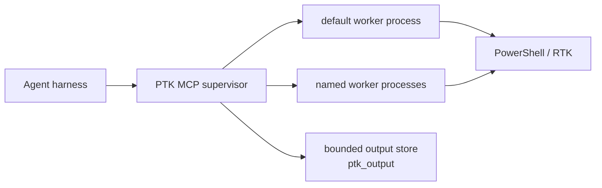

# PowerShell Token Killer (`ptk`)

[](https://github.com/AlsoBeltrix/PowerShell-Token-Killer/actions/workflows/ci.yml)

PTK is a token-efficient PowerShell execution service for AI agent harnesses.
Each MCP connection owns one supervisor process. That supervisor can manage up
to eight explicitly named sessions, including the lazy `default` session. Each
session runs in its own contained worker process with one warm PowerShell
runspace, so modules, variables, functions, working directory, environment
changes, and authenticated connections persist only inside that session.

The agent submits the original command once. PTK owns routing, output shaping
and recovery, worker lifecycle, and truthful failure reporting. It never
replays a command whose execution may have started.

> [!IMPORTANT]
> The current development branch implements the supervisor, named worker
> sessions, automatic worker replacement, five-tool MCP surface, output
> recovery, and production containment described here. PTK has not had a public
> release. See [`.agents/state.md`](.agents/state.md) for current validation and
> remaining platform gates.

## Why PTK

- **Warm, explicit state.** Foreground calls run in a selected PowerShell 7
  session. Heavy modules and connections load once per session, not once per
  command.
- **Shape-aware output.** PowerShell objects become compact typed summaries,
  eligible native commands use RTK's filters, log-shaped text is deduplicated,
  and ordinary text is cleaned and bounded.
- **Single-execution semantics.** Routing may fall back before user work
  starts. Once work starts, PTK never retries it and never asks the model to
  reconstruct the command.
- **Recoverable context.** When PTK captures a same-invocation artifact,
  `ptk_output` can retrieve an elided middle without rerunning the operation.
- **Truthful outcomes.** A request is completed, proved not started, refused,
  canceled, timed out, or reported outcome-unknown. PTK does not turn a lost
  transport into a false success.
- **Contained sessions.** Each warm session is a separate worker process.
  Reset, timeout, or loss of one session does not silently replace or corrupt
  another.

PTK is not a sandbox or authorization boundary. Commands inherit the identity,
privileges, network access, and upstream RBAC of the harness that launched PTK.

## Architecture



One harness connection owns one public supervisor. Each session owns one serial
PowerShell runspace inside its own worker process; different sessions can
progress independently. The supervisor owns the MCP pipe, session registry,
output artifacts, admission, and replacement decisions.

On Unix, a native broker creates and contains each worker process group. On
Windows, workers start inside Job Objects before user code can run. A worker is
replaced only after its old containment domain is proved empty. If an escaped
descendant makes that proof impossible, the session faults
`descendants_unknown` and refuses reuse.

While the MCP connection remains open, inactivity does not recycle warm
workers. A timed-out or lost worker is replaced from a fresh baseline; its
uncertain command is never replayed. Supervisor failure ends the MCP connection
and requires the harness to start a new one.

Sessions are deliberately harness-scoped. There is no daemon, reattachment,
cross-harness session, shared runspace, or durable session key in this design.

## Sessions

The reserved `default` session preserves unqualified tool calls and starts
lazily:

```text
ptk_invoke(script="Import-Module ActiveDirectory")
ptk_invoke(script="Get-ADUser alice")
```

Named sessions make independent warm contexts explicit:

```text
ptk_session(action="open", name="ad")
ptk_invoke(session="ad", script="Import-Module ActiveDirectory")

ptk_session(action="open", name="exo")
ptk_invoke(session="exo", script="Connect-ExchangeOnline ...")

ptk_state(session="ad")
ptk_reset(session="exo")
```

Session rules:

- Names are connection-local semantic aliases such as `ad`, `exo`, or `build`.
  Every non-default operation names its session; there is no mutable `select`.
- Unknown or closed named sessions never fall back to `default` and never
  auto-create after a typo.
- `ptk_reset` replaces the entire selected worker. It does not affect another
  session and refuses while the selected session is busy or old containment is
  unconfirmed.
- After an execution timeout returns its terminal and the old worker tree is
  confirmed dead, an otherwise eligible session automatically starts its next
  worker from the factory baseline. The timed-out call is never replayed.
- `ptk_session` supports `list`, `open`, and `close`. The lazy `default`
  session cannot be closed. Closed named sessions require an explicit `open`.
- At most eight sessions, including `default`, may be open on one connection.

### Long-running work

Raise `timeoutSeconds` when work needs the selected warm session. The budget
includes same-session queue wait and execution. PTK has no public background-job
surface. Every process started by `ptk_invoke` belongs to that session worker's
containment tree and is terminated when an executing call times out or the
worker is reset, closed, replaced, or shut down. `Start-Process` inside PTK is
not a supported detach path and must not be used for work that needs to survive
those events.

Start long stateless work outside PTK through the harness's ordinary process
facilities, redirect its results to caller-chosen files, and poll it there. If
the work needs warm-session state, use a dedicated PTK session with a sufficient
foreground timeout; PTK intentionally provides no way to both inherit that
state and outlive its worker.

## MCP Tools

The public surface is exactly five tools:

| Tool | Purpose |
| --- | --- |
| `ptk_invoke` | Execute the original script once in the selected warm session. |
| `ptk_output` | Discover, read, search, or inspect an immutable same-invocation artifact. It accepts no script and never executes work. |
| `ptk_state` | Report supervisor and selected-session health, worker PID, engine, cwd, modules, and drift without queueing behind that session. |
| `ptk_reset` | Replace one idle session worker and restore its factory baseline. |
| `ptk_session` | List sessions, open a named session, or close an idle named session. |

Signatures, shown compactly:

```text
ptk_invoke(script, route="auto", timeoutSeconds=0, raw=false,
           session="default")
ptk_output(handle=null, action="read", offset=0, maxBytes=<bounded>,
           pattern=null, session=null)
ptk_state(listAvailable=false, session="default")
ptk_reset(session="default")
ptk_session(action, name=null)
```

## Routing and Output

The dialect is PowerShell 7. With `route="auto"`, PTK asks RTK whether the
exact submitted text can be rewritten to route through its filters:

1. RTK returns a rewrite — PTK executes that rewrite in the selected warm
   runspace. Compound commands (`git status && cargo test`) and env-prefixed
   commands rewrite per segment; segments RTK does not recognize are preserved
   untouched.
2. RTK declines — PTK executes the exact original text as PowerShell. Cmdlets,
   functions, object pipelines, and mixed dataflow always land here, as does
   anything RTK will not touch (heredocs, multi-line blocks, unknown commands).
3. A missing RTK is a startup failure, not a per-call fallback, so there is no
   unfiltered-but-running mode to reason about.

Rewriting happens before any user process starts, and there is never a
post-start retry.

Overrides are deliberately narrow:

- `route="pwsh"` skips the RTK rewrite entirely and runs the exact original
  text as PowerShell. Normal capture and shaping still apply.
- `route="rtk"` asserts RTK routing. RTK still decides: if it declines to
  rewrite the script, the labeled fallback executes the exact original once.
- `raw=true` is deprecated compatibility telemetry. It does not change the
  interpreter, route, process, capture, bounds, or shaping, and it is not an
  output-recovery mechanism.

Output is shaped by provenance:

- PowerShell objects become compact typed summaries before formatting.
- RTK-routed native output is treated as already RTK-processed and is never
  sent through `rtk log` a second time.
- Direct log-shaped text may be deduplicated through RTK.
- Plain text has terminal control sequences removed and is bounded by a
  labeled head/tail window.

PowerShell stream records follow the output in labeled sections. Errors and
warnings use `[errors]` and `[warnings]`; `Write-Host`/information records use
`[information]`; verbose records use `[verbose]`. The immutable `ptk_output`
artifact retains the same captured streams. Progress records are transient UI
state and are intentionally not captured.

When PTK owns a capture, the result may include a `ptk_output` handle for the
immutable artifact. Handles remain readable across reset and session close
until ordinary TTL or quota eviction, but never outlive the supervisor.
Expired, evicted, unavailable, and incomplete artifacts are reported
explicitly.

If a caller disconnects before receiving a completed response, use
`ptk_output(action="list", session="<name>")` on the same MCP connection to
discover up to the ten newest retained snapshots, then pass a listed handle to
`read`, `search`, or `status`. Omit `session` to list across that connection.
Listing never reruns work, starts no worker, and does not extend retention.

The end-state design was frozen against adjacent RTK commit `5d32d07` and an
independent RTK 0.43.0 runtime probe; neither exposed the trustworthy
machine-readable capture seam PTK needs for raw recovery. Under that
seam-absent contract, RTK-routed work remains single-execution but reports
`recovery=unavailable`; PTK never parses a human tee-path hint or reruns the
command. A future negotiated seam can add a truthful handle without changing
execution routing.

## Audit status

The mandatory local journal is admission, replay, and delivery
infrastructure—not a SIEM destination or investigation dashboard. An operator
explicitly selects one SIEM destination; additional destinations require
deliberate opt-in. PTK never installs or selects a hidden destination, and its
mini-SIEM is deployed separately when a full SIEM is unavailable.

Published `0.3.0-rc.1` predates full-fidelity evidence export. Current source
exports typed exact command, caller-response, and captured output/error
artifacts. The standalone receiver indexes their correlation metadata, tracks
manifest completeness, and serves authorized exact reassembly. The dashboard
now includes authorized activity investigation and exact evidence reassembly.
The receiver is separately installed with its packaged `manage.ps1`; PTK's
packaged `scripts/ptk-audit-destination.ps1` explicitly selects it or an external
SIEM without hand-written JSON. Real external-SIEM product acceptance remains open.

Auditing is base-level and non-bypassable. Every server boot opens a
mandatory, fail-closed local journal (default `~/.ptk/audit`, override
`PTK_AUDIT_ROOT`) before serving any tool call: a healthy root journals every
invoke durably before it runs, and an unwritable root refuses invokes
fail-closed while the transport stays up. The local journal is the only
execution gate — SIEM export is an optional, asynchronous leg that never
gates execution: one endpoint-plus-token contract covers Splunk HEC, any
OTLP/HTTP collector, and PTK's own standalone receiver (`siem/`, the fallback
for environments without a SIEM, with its own query dashboard and alerting).
A loopback web UI (default port 8317) serves the journal, quarantine
evidence, export health, and settings. See
[the audit, export, and receiver contract](server/AUDIT-EXPORT.md).

Scripts and output artifacts can contain passwords, tokens, customer data, or
other secrets — and the audit journal persists the **exact submitted script
bytes** of every invoke as protected evidence. Protect the PTK output root
AND the audit root (default `~/.ptk/audit`), including any backups or copies
of either, as sensitive data.

## Security and Containment

Worker processes isolate warm state and reduce reset/crash blast radius. They
do not make hostile code safe and do not replace OS identity or upstream RBAC.

The supervisor and each worker's platform containment authority treat confirmed
process-tree termination as a prerequisite for replacement. If containment
cannot be confirmed, that session becomes visibly faulted and refuses
replacement rather than running overlapping workers. Harness EOF tears down the
supervisor and every worker it owns.

Install and run PTK as the ordinary user who runs the agent harness. The public
installer refuses root/Administrator installation; launching the harness
elevated still launches PTK elevated.

## Installation

### Public install

Installs self-contained release binaries without cloning this repository or
requiring the .NET SDK. Windows and macOS assets carry the platform signatures
described below; Linux assets use checksum integrity and are not publisher
code-signed:

```powershell
$stage = Join-Path ([IO.Path]::GetTempPath()) ('ptk-install-' + [guid]::NewGuid())
try {
  New-Item -ItemType Directory -Path $stage | Out-Null
  $repository = 'AlsoBeltrix/PowerShell-Token-Killer'
  $headers = @{ Accept = 'application/vnd.github+json' }
  $releases = Invoke-RestMethod `
    -Uri "https://api.github.com/repos/$repository/releases?per_page=100" `
    -Headers $headers
  $published = @($releases | ForEach-Object {
    if ($_.draft -isnot [bool]) { throw 'GitHub returned an invalid draft flag.' }
    if (-not $_.draft -and $null -ne $_.published_at) {
      [DateTimeOffset]$publishedAt = [DateTimeOffset]::MinValue
      if (-not [DateTimeOffset]::TryParse([string]$_.published_at, [ref]$publishedAt)) {
        throw 'GitHub returned an invalid publication timestamp.'
      }
      if ([string]::IsNullOrWhiteSpace([string]$_.tag_name)) {
        throw 'GitHub returned a published release without a tag.'
      }
      [pscustomobject]@{ Tag = [string]$_.tag_name; PublishedAt = $publishedAt }
    }
  } | Sort-Object PublishedAt -Descending)
  if ($published.Count -eq 0) { throw 'No published PTK release exists.' }
  if ($published.Count -gt 1 -and
      $published[0].PublishedAt -eq $published[1].PublishedAt) {
    throw 'Latest PTK release is ambiguous.'
  }
  $tag = $published[0].Tag
  $version = $tag -replace '^[vV]', ''
  $releaseTag = [Uri]::EscapeDataString($tag)
  $release = "https://github.com/$repository/releases/download/$releaseTag"
  $bundle = Join-Path $stage 'ptk-installer.zip'
  $sums = Join-Path $stage 'SHA256SUMS'
  Invoke-WebRequest -Uri "$release/ptk-installer.zip" -OutFile $bundle
  Invoke-WebRequest -Uri "$release/SHA256SUMS" -OutFile $sums
  $expected = @(Get-Content -LiteralPath $sums | ForEach-Object {
    if ($_ -match '^([0-9a-fA-F]{64})\s+ptk-installer\.zip$') {
      $Matches[1].ToLowerInvariant()
    }
  })
  if ($expected.Count -ne 1) { throw 'SHA256SUMS has no unique ptk-installer.zip entry.' }
  $actual = (Get-FileHash -LiteralPath $bundle -Algorithm SHA256).Hash.ToLowerInvariant()
  if ($actual -cne $expected[0]) { throw 'ptk-installer.zip checksum verification failed.' }
  Expand-Archive -LiteralPath $bundle -DestinationPath $stage
  & (Join-Path $stage 'install.ps1') -FromRelease -Version $version
}
finally {
  Remove-Item -LiteralPath $stage -Recurse -Force -ErrorAction SilentlyContinue
}
```

The release-scoped `ptk-installer.zip` contains `scripts/install.ps1` and the
two modules it imports. The bootstrap verifies it against the same
release's `SHA256SUMS` before executing it. For a prerelease or pinned version,
download from `releases/download/v<VERSION>/ptk-installer.zip` and pass
`-FromRelease -Version <VERSION>`.

One installer, `scripts/install.ps1`, runs on every platform. It needs
PowerShell 7, which is also what ptk runs. `-FromRelease` takes the latest
published release, including a prerelease
(`-Version 0.2.1` pins one); without it, the installer builds this checkout,
which additionally needs the .NET SDK. Everything after the payload is
obtained is identical either way.

Every newly built package has an exact identity independent of its product
version and source commit. `BUILD-PROVENANCE.json` records the product version,
full source commit, clean/dirty source state, UTC build time, target RID, and a
fresh 32-hex build identity. `ptk_state` and audit records report the matching
`<version>+<short-commit>.build.<build-identity>` value, so two rebuilds of the
same commit cannot be mistaken for each other. The manifest remains installed
at `~/.ptk/BUILD-PROVENANCE.json` for offline diagnostics.

The installer:

- selects a smoke-tested `win-x64`, `win-arm64`, `linux-x64`, `linux-arm64`,
  or `osx-arm64` asset and verifies it against `SHA256SUMS`;
- refuses to run elevated, and refuses to replace a payload that is in use;
- installs one self-contained supervisor whose internal worker mode owns the
  named session processes, plus `PtkWorkerBroker` on Unix;
- installs per-user under `~/.ptk` and preserves user-owned configuration on
  upgrade and uninstall;
- snapshots the prior installer-owned payload and restores it after any
  activation or registration failure;
- **ensures RTK is present before registering.** RTK is required, so an rtk
  already on `PATH` is used as-is, and otherwise the matching rtk is fetched
  from its own releases, verified against its `checksums.txt`, and recorded so
  uninstall removes only the copy the installer placed. The check probes
  `rtk hook check`, not `rtk --version`: the rewriter has to actually answer.
  If it cannot, the install aborts rather than leaving a server that exits 78;
- runs the per-agent init, which wires up the detected harnesses — claude,
  codex, grok, agy, kimi — after one pacman-style consent prompt listing what
  was found (Enter wires all; `-Agent`/`-SkipAgent`/`-AllAgents` pre-answer,
  and a non-interactive session wires all with a notice). Skipped harnesses
  print the manual registration command; and
- supports `-Uninstall`, which reverses all of it and keeps user files;
  `-Purge` also removes them.

The installed payload is self-contained: the server embeds its own PowerShell
engine and does not need one installed to run. Winget packaging is a
post-v0.2.0 follow-up, not a currently working install path.

### Signing

Release authenticity differs by platform from v0.2.1 onward:

- **Windows** assets are Authenticode-signed with Azure Trusted Signing and
  countersigned by a timestamp authority, so signatures stay valid after the
  signing certificate expires. Verified on a published asset:
  `Get-AuthenticodeSignature` reports `Status=Valid`, issued by
  `Microsoft ID Verified CS EOC CA 03`.
- **macOS** assets are Developer ID-signed with hardened runtime and
  notarized with Apple. Verified on a published asset: `codesign --verify
  --strict` passes with the `Developer ID Application → Developer ID
  Certification Authority → Apple Root CA` chain and a timestamp. A bare
  CLI binary cannot carry a stapled notarization ticket, so Gatekeeper
  checks acceptance online; `spctl -t exec` declines to assess it as an
  "app", which is expected and not a signing failure.
- **Linux** assets are not publisher code-signed. The installer verifies each
  asset against the release's `SHA256SUMS` before extraction.

`-FromRelease` preserves the Windows and macOS signatures and verifies every
platform asset against `SHA256SUMS`; it extracts byte-for-byte and never
rewrites a binary.
**Binaries you build yourself are unsigned**, which is expected for the
from-source path below and may prompt SmartScreen if you move them between
machines. v0.2.0 predates the Windows and macOS signing described above.

### Installing from source

Omit `-FromRelease` to build and install this checkout instead. That path
additionally needs the .NET SDK.

```powershell
pwsh -NoProfile -File scripts/install.ps1
```

For source debugging, you can instead build the checkout and register the
stdout-clean no-build launch directly:

```powershell
dotnet build <repo>/server/PtkMcpServer -v q --nologo
claude mcp add ptk --scope user -- dotnet run --no-build --no-launch-profile -v q --project <repo>/server/PtkMcpServer
```

Repeat the build after changing source. Do not omit `--no-build`: `dotnet`
restore/build warnings use stdout and can corrupt the MCP JSON-RPC stream. The
launch-profile bypass likewise prevents later development profiles from
injecting launch behavior. The direct command launches a build-tree process
and bypasses the packaged stage/activate/rollback transaction. Use the
development installer when testing the production package boundary.

The committed `.mcp.json` is intentionally empty; a checkout does not install
itself into project scope.

### Windows Defender false positive (issue #7)

Microsoft Defender Antivirus has falsely detected `PtkMcpServer.dll` as
`Trojan:MSIL/AsyncRAT.AB!MTB` on Windows and quarantined it out of the build
output and the installed `~/.ptk/bin` payload. The symptom is an install or
build that appears to succeed while the DLL silently disappears;
`scripts/install.ps1` now detects the missing file and fails with
guidance instead. The file has been submitted to Microsoft for a
false-positive determination (status tracked in
[issue #7](https://github.com/AlsoBeltrix/PowerShell-Token-Killer/issues/7);
submission runbook: `.agents/plans/defender-fp-submission.md`).

If you hit this: check Defender's protection history to confirm the
quarantine, restore the file only if you built it yourself from a checkout
you trust, and prefer a narrow, temporary exclusion for `~/.ptk/bin` over any
broad one — remove it once Microsoft ships corrected security intelligence.

### MSIX-packaged PowerShell hides its modules from ptk (issue #40)

**Windows ARM64 users hit this on the default install path.** If PowerShell 7
came from an MSIX package, importing some modules inside a ptk session fails
with `Could not load file or assembly '...\WindowsApps\...'. Access is
denied.` — typically `PSReadLine`, `Microsoft.PowerShell.ThreadJob`,
`PackageManagement`, `PowerShellGet`, and
`Microsoft.PowerShell.PSResourceGet`.

You get an MSIX PowerShell from the Microsoft Store on any architecture, and
— less obviously — from `winget install Microsoft.PowerShell` **on ARM64**,
where the winget manifest offers only `PowerShell-<version>.msixbundle`.
On x64 the same winget command installs the MSI and is unaffected, which is
why one machine can hit this while another, installed "the same way", does
not.

**This is not a permissions problem, and elevating will not fix it.** ptk's
worker runs its own bundled PowerShell runtime, and Windows will not let a
process load executable code out of an MSIX package it is not part of.
Measured on a Windows 11 ARM64 bench: the worker holds the same token,
integrity level, and elevation as an ordinary shell, opens the very DLL
file, and lists its directory — only the code load is refused. The same
module copied to an ordinary directory imports fine. Script-only modules
under the package tree are unaffected, and so are ptk's core cmdlets, which
live in the runtime ptk ships rather than in any module tree.

Two fixes, either one sufficient:

- Install the **standalone MSI** — `PowerShell-<version>-win-arm64.msi` (or
  `-win-x64.msi`) from the
  [PowerShell releases](https://github.com/PowerShell/PowerShell/releases).
  This is the durable answer. Note that winget cannot do it for you on
  ARM64: `winget install Microsoft.PowerShell --installer-type msi` is
  refused with `No applicable installer found`.
- Or copy the module directory somewhere ordinary and add that path to
  `PSModulePath`.

ptk detects this exact failure and prints a `[ptk hint]` naming the cause
and both fixes, so you do not have to recognize it from the raw .NET error.

## RTK Integration

[RTK](https://github.com/rtk-ai/rtk), the Rust Token Killer, owns native-command
filtering and log compression. **RTK is required.** PTK is a compression
router: it compresses PowerShell objects itself and routes everything else to
RTK, so a PTK without RTK cannot do half its job. The server resolves RTK from
`PTK_RTK_PATH` or `PATH` and pins its executable identity at startup; if it
finds none, it refuses to start and says so rather than coming up as a
silently-unfiltered passthrough.

PTK's release assets do not bundle RTK. The installer resolves it for you: an
rtk already on `PATH` is used as-is and never touched, and otherwise the
matching build is downloaded from RTK's own releases, verified against its
`checksums.txt`, and placed in `~/.ptk/bin`. Uninstall removes only a copy the
installer placed. Windows ARM64 has no upstream aarch64 rtk and runs the x64
build under emulation; the installer probes `rtk hook check` to confirm that
actually works before completing.

Routing is RTK's decision, not PTK's. PTK submits the exact submitted text to
`rtk hook check`; when RTK returns a rewrite, PTK executes that, and when RTK
declines, PTK executes the original text unchanged. RTK decomposes `&&`, `||`,
and `;` and rewrites each segment it recognizes while preserving the rest, so
compound commands route without PTK modelling any of it.

## Harness Integration and Hook

The currently implemented and live-verified redirect hook intercepts Claude
Code shell calls and points the agent at `ptk_invoke`. It is an adoption aid,
not a security control: calls that reach PTK are journaled (see Audit
status), but a command that bypasses the hook never reaches PTK or its
journal. `PTK_DIRECT` in a
command comment is the explicit escape hatch when PTK is unavailable or the
command needs a real TTY. Other harnesses receive only the capabilities
recorded in the support matrix below.

For current live-verified registration, hook, and guidance behavior by
harness, see [the harness support matrix](docs/harness-support.md). The
developer installer runs the implemented per-harness initialization after a
successful install.

## Repository Layout and Verification

- `server/PtkMcpServer/` — public MCP supervisor and internal worker runtime.
- `server/PtkMcpServer.Tests/` — server, audit, routing, and lifecycle tests.
- `src/PwshTokenCompressor.psd1` — PowerShell object/text shaping library.
- `scripts/` — development install and harness integration tooling.

The module is a library, not a separate CLI face. `ptk_invoke` is the product
surface.

Run the complete local verification battery:

```powershell
pwsh -NoProfile -Command "Invoke-Pester -Path tests/PwshTokenCompressor.Tests.ps1 -Output Minimal"
dotnet test server/PtkMcpServer.slnx
dotnet test siem/PtkSiem.slnx
pwsh -NoProfile -File server/test-handshake.ps1
```

## More Documentation

- [MCP server setup, configuration, and operations](server/README.md)
- [Audit, export, and SIEM receiver contract](server/AUDIT-EXPORT.md)
- [Harness capability matrix](docs/harness-support.md)
- [Known limitations](docs/known-limitations.md)
- [Privacy](PRIVACY.md)
- [Contributing](CONTRIBUTING.md)
- [Release recovery and withdrawal](docs/release-recovery.md)
- [Release-notes template](docs/release-notes-template.md)
- [Current implementation state](.agents/state.md)

## Credits

PowerShell Token Killer is named after, and heavily inspired by,
[RTK](https://github.com/rtk-ai/rtk). RTK proved that agent shell output should
be compressed at the source; PTK extends that idea to PowerShell objects, warm
session state, isolated workers, supervised execution, and recoverable output.
